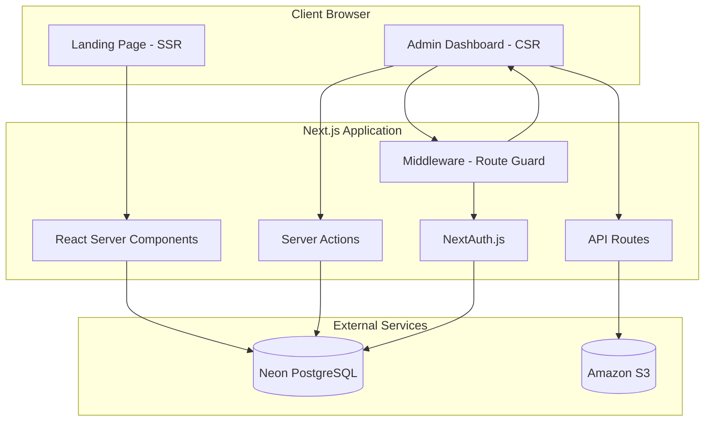
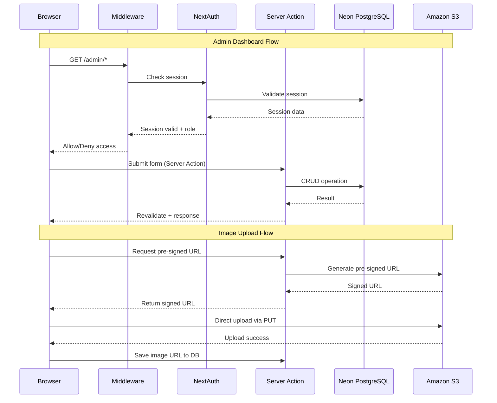
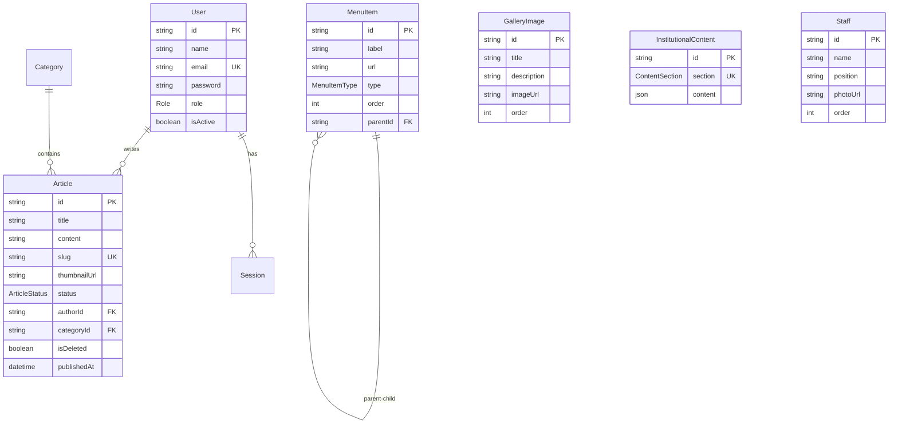

# Design Document: CMS SMKN 1 Surabaya

## Overview

CMS SMKN 1 Surabaya adalah sistem manajemen konten full-stack yang dibangun menggunakan Next.js 14 (App Router) untuk mengelola website sekolah SMKN 1 Surabaya. Sistem ini terdiri dari dua bagian utama:

1. **Landing Page Publik** — Halaman website sekolah yang dirender secara server-side (SSR) untuk optimasi SEO, menampilkan informasi institusional, berita, galeri, dan data guru/staf. Desain mengacu pada referensi `index4.html` dengan tema navy premium.

2. **Admin Dashboard** — Panel administrasi yang dilindungi autentikasi untuk mengelola seluruh konten website, termasuk menu navigasi, konten institusional, berita/artikel, galeri foto, data guru, dan akun staf.

### Tech Stack

| Layer | Teknologi |
|-------|-----------|
| Framework | Next.js 14 (App Router, SSR) |
| Styling | Tailwind CSS + shadcn/ui |
| Database | Neon (Serverless PostgreSQL) |
| ORM | Prisma |
| Auth | NextAuth.js v5 (Auth.js) dengan Prisma Adapter |
| Storage | Amazon S3 (Pre-signed URLs) |
| Carousel | Embla Carousel (via shadcn/ui) |
| Rich Text | Tiptap Editor |
| Drag & Drop | @dnd-kit/core + @dnd-kit/sortable |

### Key Design Decisions

- **Next.js App Router** dipilih karena mendukung React Server Components (RSC) untuk SSR landing page, route groups untuk pemisahan layout publik dan admin, serta middleware untuk route protection.
- **Neon PostgreSQL** dipilih sebagai database serverless yang kompatibel dengan Prisma dan mendukung connection pooling untuk deployment serverless.
- **Amazon S3 dengan Pre-signed URLs** dipilih agar upload file dilakukan langsung dari browser ke S3 tanpa melewati server, mengurangi beban server dan meningkatkan performa upload.
- **Embla Carousel** (bawaan shadcn/ui) digunakan sebagai pengganti Swiper.js untuk konsistensi dengan ekosistem shadcn/ui.
- **Tiptap Editor** dipilih sebagai rich-text editor karena extensible, headless, dan kompatibel dengan React/Next.js.
- **@dnd-kit** dipilih untuk fitur drag-and-drop pada Menu Builder karena accessible, performant, dan mendukung nested sortable.

## Architecture

### High-Level Architecture



### Application Structure

```
src/
├── app/
│   ├── (public)/                  # Route group: Landing page publik
│   │   ├── layout.tsx             # Layout publik (navbar + footer)
│   │   ├── page.tsx               # Landing page utama (SSR)
│   │   ├── berita/
│   │   │   ├── page.tsx           # Daftar berita
│   │   │   └── [slug]/page.tsx    # Detail artikel
│   │   └── profil/page.tsx        # Halaman profil sekolah
│   ├── (auth)/
│   │   └── login/page.tsx         # Halaman login
│   ├── admin/
│   │   ├── layout.tsx             # Layout admin (sidebar + header)
│   │   ├── page.tsx               # Dashboard overview
│   │   ├── menu/page.tsx          # Menu Builder
│   │   ├── konten/page.tsx        # Manajemen konten institusional
│   │   ├── berita/
│   │   │   ├── page.tsx           # Daftar artikel
│   │   │   └── [id]/edit/page.tsx # Edit artikel
│   │   ├── galeri/page.tsx        # Manajemen galeri
│   │   ├── guru/page.tsx          # Manajemen data guru
│   │   └── pengguna/page.tsx      # Manajemen akun staf
│   ├── api/
│   │   ├── auth/[...nextauth]/route.ts
│   │   └── upload/presign/route.ts  # Generate pre-signed URL
│   └── layout.tsx                 # Root layout
├── components/
│   ├── public/                    # Komponen landing page
│   │   ├── navbar.tsx
│   │   ├── hero-section.tsx
│   │   ├── profile-news-section.tsx
│   │   ├── principal-section.tsx
│   │   ├── gallery-section.tsx
│   │   ├── staff-slider.tsx
│   │   └── footer.tsx
│   ├── admin/                     # Komponen admin dashboard
│   │   ├── sidebar.tsx
│   │   ├── menu-builder.tsx
│   │   ├── article-editor.tsx
│   │   ├── image-uploader.tsx
│   │   └── data-table.tsx
│   └── ui/                        # shadcn/ui components
├── lib/
│   ├── prisma.ts                  # Prisma client singleton
│   ├── auth.ts                    # NextAuth config
│   ├── s3.ts                      # S3 client & pre-signed URL helper
│   ├── rbac.ts                    # RBAC permission checker
│   └── validators.ts             # Zod schemas untuk validasi
├── actions/                       # Server Actions
│   ├── menu.ts
│   ├── content.ts
│   ├── article.ts
│   ├── gallery.ts
│   ├── staff.ts
│   └── user.ts
├── types/
│   └── index.ts                   # TypeScript type definitions
└── middleware.ts                   # Route protection middleware
```

### Request Flow



## Components and Interfaces

### 1. Authentication Module (`lib/auth.ts`)

```typescript
// NextAuth.js v5 configuration
interface AuthConfig {
  providers: [CredentialsProvider]
  adapter: PrismaAdapter
  session: { strategy: "database" }
  callbacks: {
    session: (params) => SessionWithRole  // Inject role into session
    authorized: (params) => boolean       // Middleware check
  }
}

interface SessionWithRole extends Session {
  user: {
    id: string
    name: string
    email: string
    role: "SUPER_ADMIN" | "EDITOR" | "CONTRIBUTOR"
    isActive: boolean
  }
}
```

### 2. RBAC Module (`lib/rbac.ts`)

```typescript
type Role = "SUPER_ADMIN" | "EDITOR" | "CONTRIBUTOR"
type Permission = 
  | "menu:manage"
  | "content:manage"
  | "article:create" | "article:edit" | "article:publish" | "article:delete"
  | "gallery:manage"
  | "staff:manage"
  | "user:manage"

// Permission matrix
const ROLE_PERMISSIONS: Record<Role, Permission[]> = {
  SUPER_ADMIN: ["menu:manage", "content:manage", "article:create", "article:edit", 
                "article:publish", "article:delete", "gallery:manage", "staff:manage", "user:manage"],
  EDITOR: ["content:manage", "article:create", "article:edit", "article:publish", 
           "article:delete", "gallery:manage", "staff:manage"],
  CONTRIBUTOR: ["article:create", "article:edit"]
}

function hasPermission(role: Role, permission: Permission): boolean
function requirePermission(permission: Permission): ServerActionGuard
```

### 3. Route Guard Middleware (`middleware.ts`)

```typescript
// Next.js middleware for route protection
export function middleware(request: NextRequest): NextResponse {
  // 1. Check if route starts with /admin
  // 2. Validate session via NextAuth
  // 3. Check role-based access for specific admin routes
  // 4. Redirect to /login if unauthenticated
  // 5. Return 403 if unauthorized for specific route
}

export const config = {
  matcher: ["/admin/:path*"]
}
```

### 4. Menu Builder Component (`components/admin/menu-builder.tsx`)

```typescript
interface MenuItemForm {
  label: string
  url: string
  type: "INTERNAL" | "EXTERNAL"
  parentId: string | null
  order: number
}

interface MenuBuilderProps {
  items: MenuItemWithChildren[]
}

// Menggunakan @dnd-kit untuk drag-and-drop
// Mendukung nested menu hingga 2 level
// Server Action untuk save: actions/menu.ts
```

### 5. Image Uploader Component (`components/admin/image-uploader.tsx`)

```typescript
interface ImageUploaderProps {
  onUploadComplete: (url: string) => void
  maxSizeMB?: number          // Default: 5
  acceptedFormats?: string[]   // Default: ["image/jpeg", "image/png", "image/webp"]
  multiple?: boolean           // Default: false
}

// Flow:
// 1. Client validates file type & size
// 2. Request pre-signed URL from API route
// 3. Upload directly to S3 via PUT
// 4. Return S3 URL to parent component
```

### 6. S3 Pre-signed URL Service (`lib/s3.ts`)

```typescript
import { S3Client, PutObjectCommand } from "@aws-sdk/client-s3"
import { getSignedUrl } from "@aws-sdk/s3-request-presigner"

interface PresignResult {
  uploadUrl: string    // Pre-signed PUT URL
  fileUrl: string      // Public URL setelah upload
  key: string          // S3 object key
}

async function generatePresignedUrl(
  filename: string,
  contentType: string
): Promise<PresignResult>

async function deleteS3Object(key: string): Promise<void>
```

### 7. Server Actions Interface

```typescript
// actions/menu.ts
async function getMenuItems(): Promise<MenuItemWithChildren[]>
async function saveMenuItems(items: MenuItemForm[]): Promise<void>
async function deleteMenuItem(id: string): Promise<void>

// actions/article.ts
async function getArticles(params: ArticleFilter): Promise<PaginatedResult<Article>>
async function createArticle(data: ArticleForm): Promise<Article>
async function updateArticle(id: string, data: ArticleForm): Promise<Article>
async function publishArticle(id: string): Promise<Article>
async function softDeleteArticle(id: string): Promise<void>

// actions/gallery.ts
async function getGalleryImages(): Promise<GalleryImage[]>
async function addGalleryImages(images: GalleryImageForm[]): Promise<void>
async function reorderGalleryImages(orderedIds: string[]): Promise<void>
async function deleteGalleryImage(id: string): Promise<void>

// actions/content.ts
async function getInstitutionalContent(section: ContentSection): Promise<InstitutionalContent>
async function updateInstitutionalContent(section: ContentSection, content: JsonValue): Promise<void>

// actions/staff.ts
async function getStaffList(): Promise<Staff[]>
async function createStaff(data: StaffForm): Promise<Staff>
async function updateStaff(id: string, data: StaffForm): Promise<Staff>
async function deleteStaff(id: string): Promise<void>

// actions/user.ts
async function getUsers(): Promise<User[]>
async function createUser(data: UserForm): Promise<User>
async function deactivateUser(id: string): Promise<void>
async function resetPassword(id: string): Promise<{ temporaryPassword: string }>
```

### 8. Landing Page Components

```typescript
// components/public/navbar.tsx
// - Sticky header, logo SMKN 1 Surabaya, dynamic menu dari DB
// - Mobile hamburger menu dengan toggle
// - Active link highlighting

// components/public/hero-section.tsx
// - Background navy (#002244), berita highlight terbaru
// - Deskripsi, tombol CTA "Baca Lebih Lanjut", gambar utama
// - Badge label (e.g., "Prestasi Siswa"), dot indicators

// components/public/profile-news-section.tsx
// - Layout 2 kolom: profil + video (7/12) | berita terbaru (5/12)
// - Video embed dengan play button overlay
// - Daftar 3 berita terbaru dengan thumbnail

// components/public/principal-section.tsx
// - Pattern background (radial-gradient dots pada #004d80)
// - Teks prakata italic, nama & jabatan kepala sekolah
// - Foto dengan border kuning

// components/public/gallery-section.tsx
// - Grid responsif: 2 kolom (mobile), 3 (tablet), 4 (desktop)
// - Hover zoom effect pada gambar
// - Link "Lihat Semua"

// components/public/staff-slider.tsx
// - Embla Carousel: 2 slide (mobile), 3 (tablet), 4 (desktop)
// - Autoplay dengan pagination dots
// - Card: foto circular grayscale, nama, jabatan

// components/public/footer.tsx
// - 4 kolom: identitas + sosmed, tautan cepat, informasi, kontak
// - Background navy, border-top kuning
// - Copyright bar
```

## Data Models

### Prisma Schema

```prisma
datasource db {
  provider = "postgresql"
  url      = env("DATABASE_URL")
  directUrl = env("DIRECT_URL")  // Neon direct connection for migrations
}

generator client {
  provider = "prisma-client-js"
}

enum Role {
  SUPER_ADMIN
  EDITOR
  CONTRIBUTOR
}

enum ArticleStatus {
  DRAFT
  PUBLISHED
}

enum MenuItemType {
  INTERNAL
  EXTERNAL
}

enum ContentSection {
  HERO
  PROFILE
  PRINCIPAL_MESSAGE
  DEPARTMENT
}

model User {
  id            String    @id @default(cuid())
  name          String
  email         String    @unique
  password      String    // bcrypt hashed
  role          Role      @default(CONTRIBUTOR)
  isActive      Boolean   @default(true)
  articles      Article[]
  sessions      Session[]
  createdAt     DateTime  @default(now())
  updatedAt     DateTime  @updatedAt
}

model Session {
  id           String   @id @default(cuid())
  sessionToken String   @unique
  userId       String
  user         User     @relation(fields: [userId], references: [id], onDelete: Cascade)
  expires      DateTime
}

model MenuItem {
  id        String       @id @default(cuid())
  label     String
  url       String
  type      MenuItemType @default(INTERNAL)
  order     Int          @default(0)
  parentId  String?
  parent    MenuItem?    @relation("MenuHierarchy", fields: [parentId], references: [id], onDelete: Cascade)
  children  MenuItem[]   @relation("MenuHierarchy")
  createdAt DateTime     @default(now())
  updatedAt DateTime     @updatedAt
}

model Category {
  id       String    @id @default(cuid())
  name     String
  slug     String    @unique
  articles Article[]
}

model Article {
  id           String        @id @default(cuid())
  title        String
  content      String        // Rich-text HTML from Tiptap
  slug         String        @unique
  thumbnailUrl String?
  status       ArticleStatus @default(DRAFT)
  authorId     String
  author       User          @relation(fields: [authorId], references: [id])
  categoryId   String?
  category     Category?     @relation(fields: [categoryId], references: [id])
  isDeleted    Boolean       @default(false)  // Soft delete
  publishedAt  DateTime?
  createdAt    DateTime      @default(now())
  updatedAt    DateTime      @updatedAt

  @@index([status, isDeleted, publishedAt])
  @@index([slug])
}

model GalleryImage {
  id          String   @id @default(cuid())
  title       String
  description String?
  imageUrl    String
  order       Int      @default(0)
  createdAt   DateTime @default(now())
  updatedAt   DateTime @updatedAt
}

model InstitutionalContent {
  id        String         @id @default(cuid())
  section   ContentSection @unique
  content   Json           // Flexible JSON for each section type
  updatedAt DateTime       @updatedAt
}

model Staff {
  id        String   @id @default(cuid())
  name      String
  position  String
  photoUrl  String?
  order     Int      @default(0)
  createdAt DateTime @default(now())
  updatedAt DateTime @updatedAt
}

model SiteSettings {
  id    String @id @default(cuid())
  key   String @unique
  value Json
}
```

### InstitutionalContent JSON Structures

```typescript
// section: HERO
interface HeroContent {
  title: string
  description: string
  imageUrl: string
  badgeLabel: string
  ctaText: string
  ctaUrl: string
}

// section: PROFILE
interface ProfileContent {
  description: string
  videoUrl: string
  visi: string       // Rich-text HTML
  misi: string       // Rich-text HTML
  sejarah: string    // Rich-text HTML
}

// section: PRINCIPAL_MESSAGE
interface PrincipalContent {
  message: string    // Rich-text HTML
  name: string
  title: string
  photoUrl: string
}

// section: DEPARTMENT
interface DepartmentContent {
  departments: Array<{
    id: string
    name: string
    description: string
    imageUrl: string
  }>
}
```

### Data Flow Diagram




## Correctness Properties

*A property is a characteristic or behavior that should hold true across all valid executions of a system — essentially, a formal statement about what the system should do. Properties serve as the bridge between human-readable specifications and machine-verifiable correctness guarantees.*

### Property 1: RBAC Permission Matrix Correctness

*For any* role (SUPER_ADMIN, EDITOR, CONTRIBUTOR) and *for any* permission in the system, the `hasPermission(role, permission)` function SHALL return `true` if and only if the permission is in the defined permission set for that role according to the ROLE_PERMISSIONS matrix.

**Validates: Requirements 3.2, 3.3, 3.4, 3.7**

### Property 2: Route Guard Access Control

*For any* admin route path, *for any* session state (unauthenticated, authenticated with role), the middleware SHALL: redirect to `/login` if unauthenticated, return 403 if the role lacks permission for that route, or allow access if the role has permission.

**Validates: Requirements 2.1, 2.2, 2.3**

### Property 3: Menu Item Round-Trip Persistence

*For any* valid menu item data (label, URL, type, parentId, order), saving the item to the database and then retrieving it SHALL produce an item with identical property values.

**Validates: Requirements 4.2**

### Property 4: Menu Hierarchy Depth Constraint

*For any* menu tree stored in the database, no menu item SHALL have a nesting depth greater than 2 (parent → child, no grandchildren). The `saveMenuItems` function SHALL reject any hierarchy that violates this constraint.

**Validates: Requirements 4.3**

### Property 5: Menu Cascade Delete

*For any* menu item that has children, deleting that item SHALL also delete all of its descendant items. After deletion, no item in the database SHALL reference the deleted item's ID as its parentId.

**Validates: Requirements 4.5**

### Property 6: URL Validation

*For any* string that is not a valid URL (missing protocol, malformed domain, empty string, whitespace-only), the menu item URL validator SHALL reject it. *For any* valid URL (absolute path for internal, full URL for external), the validator SHALL accept it.

**Validates: Requirements 4.6**

### Property 7: Institutional Content Round-Trip

*For any* content section (HERO, PROFILE, PRINCIPAL_MESSAGE, DEPARTMENT) and *for any* valid content JSON matching that section's schema, saving the content via `updateInstitutionalContent` and then retrieving it via `getInstitutionalContent` SHALL produce content identical to the original input.

**Validates: Requirements 5.2, 5.3, 5.4, 5.5**

### Property 8: Article Data Round-Trip

*For any* valid article data (title, content, slug, categoryId, thumbnailUrl), creating the article and then retrieving it by ID SHALL produce an article with all original field values preserved.

**Validates: Requirements 6.1**

### Property 9: Article Status Enforcement by Role

*For any* article created by a Contributor, the resulting article status SHALL always be DRAFT regardless of the submitted status value. *For any* draft article published by an Editor, the resulting status SHALL be PUBLISHED and `publishedAt` SHALL be a non-null DateTime.

**Validates: Requirements 6.3, 6.4**

### Property 10: Article Search Filter Correctness

*For any* set of articles and *for any* search query string, all articles returned by the search function SHALL contain the query string in their title (case-insensitive). *For any* category filter, all returned articles SHALL belong to the specified category. *For any* status filter, all returned articles SHALL have the specified status.

**Validates: Requirements 6.5**

### Property 11: Soft-Delete Exclusion

*For any* article that has been soft-deleted (isDeleted = true), the article SHALL NOT appear in any normal listing or search query results. The article SHALL still exist in the database and be retrievable only through explicit admin queries that include deleted items.

**Validates: Requirements 6.6**

### Property 12: Published Articles Ordering

*For any* set of published articles returned for the landing page, the articles SHALL be ordered by `publishedAt` in descending order (newest first). For any two consecutive articles in the result, the first article's `publishedAt` SHALL be greater than or equal to the second's.

**Validates: Requirements 6.8**

### Property 13: Gallery Image Reorder Round-Trip

*For any* permutation of gallery image IDs, calling `reorderGalleryImages` with that permutation and then retrieving the gallery images SHALL return them in the specified order.

**Validates: Requirements 7.3**

### Property 14: File Type Validation

*For any* file with a MIME type not in the allowed set (image/jpeg, image/png, image/webp), the upload validator SHALL reject the file. *For any* file with an allowed MIME type and size ≤ 5MB, the validator SHALL accept the file.

**Validates: Requirements 7.6, 7.7**

### Property 15: Staff Data Round-Trip

*For any* valid staff data (name, position, photoUrl, order), creating the staff record and then retrieving it SHALL produce a record with all original field values preserved.

**Validates: Requirements 10.1**

### Property 16: Password Hashing Integrity

*For any* plaintext password used during user creation or password reset, the stored password value SHALL NOT equal the plaintext input, SHALL be a valid bcrypt hash, and SHALL verify correctly against the original plaintext using bcrypt compare.

**Validates: Requirements 12.1, 12.4**

### Property 17: Deactivated User Login Rejection

*For any* user account that has been deactivated (isActive = false), attempting to authenticate with that user's valid credentials SHALL be rejected by the Auth_System.

**Validates: Requirements 12.3**

## Error Handling

### Error Handling Strategy

| Layer | Strategy | Implementation |
|-------|----------|----------------|
| Server Actions | Try-catch with typed error responses | Return `{ success: false, error: string }` |
| API Routes | HTTP status codes + JSON error body | 400/401/403/404/500 responses |
| Middleware | Redirect or error page | Redirect to `/login` or render 403 page |
| Client Forms | Form state with error display | `useFormState` + toast notifications |
| S3 Upload | Retry with exponential backoff | Max 3 retries, then error message |
| Database | Prisma error mapping | Map PrismaClientKnownRequestError to user-friendly messages |

### Server Action Error Response Pattern

```typescript
type ActionResult<T> = 
  | { success: true; data: T }
  | { success: false; error: string; fieldErrors?: Record<string, string[]> }

// Contoh penggunaan di Server Action
async function createArticle(data: ArticleForm): Promise<ActionResult<Article>> {
  try {
    // Validate with Zod
    const validated = articleSchema.safeParse(data)
    if (!validated.success) {
      return { success: false, error: "Validasi gagal", fieldErrors: validated.error.flatten().fieldErrors }
    }
    // Check permission
    const session = await auth()
    if (!hasPermission(session.user.role, "article:create")) {
      return { success: false, error: "Anda tidak memiliki izin untuk membuat artikel" }
    }
    // Execute
    const article = await prisma.article.create({ data: { ... } })
    revalidatePath("/admin/berita")
    return { success: true, data: article }
  } catch (error) {
    if (error instanceof Prisma.PrismaClientKnownRequestError) {
      if (error.code === "P2002") {
        return { success: false, error: "Slug artikel sudah digunakan" }
      }
    }
    return { success: false, error: "Terjadi kesalahan server. Silakan coba lagi." }
  }
}
```

### Specific Error Scenarios

| Scenario | Error Code | User Message |
|----------|-----------|--------------|
| Invalid credentials | 401 | "Email atau password salah" |
| Session expired | 401 | "Sesi Anda telah berakhir. Silakan login kembali." |
| Unauthorized role | 403 | "Anda tidak memiliki izin untuk mengakses halaman ini" |
| Contributor tries to publish | 403 | "Artikel memerlukan persetujuan Editor untuk dipublikasikan" |
| Duplicate slug | 409 | "Slug artikel sudah digunakan. Silakan gunakan slug lain." |
| Invalid file type | 400 | "Format file tidak didukung. Gunakan JPG, PNG, atau WebP." |
| File too large | 400 | "Ukuran file melebihi batas 5MB" |
| S3 upload failure | 500 | "Gagal mengunggah file. Silakan coba lagi." |
| Database error | 500 | "Terjadi kesalahan server. Silakan coba lagi." |
| Last Super Admin delete | 400 | "Tidak dapat menghapus akun Super Admin terakhir" |
| Invalid menu URL | 400 | "URL tujuan tidak valid" |

### Input Validation with Zod

```typescript
// lib/validators.ts
import { z } from "zod"

const articleSchema = z.object({
  title: z.string().min(1, "Judul wajib diisi").max(200),
  content: z.string().min(1, "Konten wajib diisi"),
  slug: z.string().regex(/^[a-z0-9]+(?:-[a-z0-9]+)*$/, "Slug hanya boleh huruf kecil, angka, dan tanda hubung"),
  categoryId: z.string().cuid().optional(),
  thumbnailUrl: z.string().url().optional(),
})

const menuItemSchema = z.object({
  label: z.string().min(1, "Label wajib diisi").max(100),
  url: z.string().min(1, "URL wajib diisi"),
  type: z.enum(["INTERNAL", "EXTERNAL"]),
  parentId: z.string().cuid().nullable(),
  order: z.number().int().min(0),
})

const userSchema = z.object({
  name: z.string().min(1, "Nama wajib diisi").max(100),
  email: z.string().email("Format email tidak valid"),
  password: z.string().min(8, "Password minimal 8 karakter"),
  role: z.enum(["SUPER_ADMIN", "EDITOR", "CONTRIBUTOR"]),
})

const staffSchema = z.object({
  name: z.string().min(1, "Nama wajib diisi").max(100),
  position: z.string().min(1, "Jabatan wajib diisi").max(100),
  photoUrl: z.string().url().optional(),
  order: z.number().int().min(0),
})

const galleryImageSchema = z.object({
  title: z.string().min(1, "Judul wajib diisi").max(200),
  description: z.string().max(500).optional(),
  imageUrl: z.string().url(),
  order: z.number().int().min(0),
})

const fileUploadSchema = z.object({
  filename: z.string().min(1),
  contentType: z.enum(["image/jpeg", "image/png", "image/webp"]),
  size: z.number().max(5 * 1024 * 1024, "Ukuran file melebihi 5MB"),
})
```

## Testing Strategy

### Testing Framework & Tools

| Tool | Purpose |
|------|---------|
| Vitest | Unit test runner |
| fast-check | Property-based testing library |
| React Testing Library | Component testing |
| Prisma (test DB) | Database integration tests |
| MSW (Mock Service Worker) | API mocking for S3 |

### Test Structure

```
__tests__/
├── unit/
│   ├── rbac.test.ts              # RBAC permission logic
│   ├── validators.test.ts        # Zod schema validation
│   ├── url-validator.test.ts     # URL validation logic
│   └── slug.test.ts              # Slug generation
├── properties/
│   ├── rbac.property.test.ts     # Property 1: RBAC matrix
│   ├── route-guard.property.test.ts  # Property 2: Route guard
│   ├── menu.property.test.ts     # Properties 3, 4, 5: Menu operations
│   ├── content.property.test.ts  # Property 7: Institutional content
│   ├── article.property.test.ts  # Properties 8, 9, 10, 11, 12: Article operations
│   ├── gallery.property.test.ts  # Properties 13, 14: Gallery operations
│   ├── staff.property.test.ts    # Property 15: Staff operations
│   ├── auth.property.test.ts     # Properties 16, 17: Auth operations
│   └── validation.property.test.ts # Property 6: URL validation
├── integration/
│   ├── auth-flow.test.ts         # Login/logout/session flow
│   ├── s3-upload.test.ts         # S3 pre-signed URL + upload
│   └── menu-landing.test.ts      # Menu save → landing page display
└── components/
    ├── navbar.test.tsx            # Navbar rendering
    ├── hero-section.test.tsx      # Hero section rendering
    └── admin-sidebar.test.tsx     # Admin sidebar rendering
```

### Property-Based Testing Configuration

- Library: `fast-check` (TypeScript-native, excellent Vitest integration)
- Minimum iterations: 100 per property test
- Each property test MUST reference its design document property via tag comment
- Tag format: `// Feature: cms-sekolah, Property {N}: {title}`

### Example Property Test Structure

```typescript
// properties/rbac.property.test.ts
import { describe, it, expect } from "vitest"
import * as fc from "fast-check"
import { hasPermission, ROLE_PERMISSIONS } from "@/lib/rbac"

describe("RBAC Properties", () => {
  // Feature: cms-sekolah, Property 1: RBAC Permission Matrix Correctness
  it("should return correct permission for any role-permission combination", () => {
    const roles = ["SUPER_ADMIN", "EDITOR", "CONTRIBUTOR"] as const
    const allPermissions = [
      "menu:manage", "content:manage", "article:create", "article:edit",
      "article:publish", "article:delete", "gallery:manage", "staff:manage", "user:manage"
    ] as const

    fc.assert(
      fc.property(
        fc.constantFrom(...roles),
        fc.constantFrom(...allPermissions),
        (role, permission) => {
          const result = hasPermission(role, permission)
          const expected = ROLE_PERMISSIONS[role].includes(permission)
          expect(result).toBe(expected)
        }
      ),
      { numRuns: 100 }
    )
  })
})
```

### Unit Test Coverage Targets

| Module | Target | Focus |
|--------|--------|-------|
| RBAC (`lib/rbac.ts`) | 100% | Permission matrix, edge cases |
| Validators (`lib/validators.ts`) | 100% | All Zod schemas |
| Server Actions | 90% | CRUD operations, error handling |
| Middleware | 90% | Route protection, session checks |
| Components (admin) | 80% | Form interactions, state management |
| Components (public) | 70% | Rendering, data display |

### Dual Testing Approach

- **Unit tests** focus on: specific examples, edge cases (last Super Admin deletion, expired sessions), error conditions (S3 failures, invalid inputs), and component rendering
- **Property tests** focus on: universal properties across all inputs (RBAC matrix, round-trips, ordering, validation), comprehensive input coverage through randomization
- Both are complementary: unit tests catch concrete bugs, property tests verify general correctness across the input space
